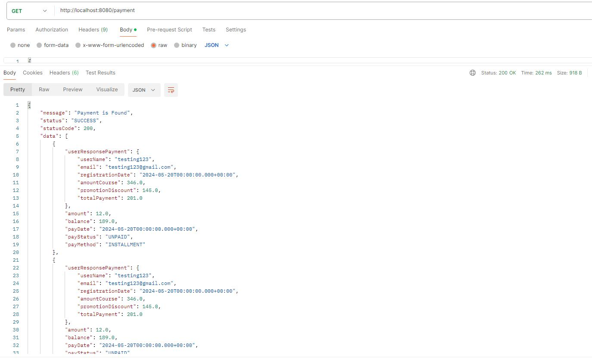

# Exercises

I have 6 microservices 
## service api-gateway
- server port 8080
- Handles routing of requests to the appropriate microservice.
## service Category and Course

- postgresql for database : CateAndCourseDb
- server port 8088
- A microservice responsible for Category and Course related operations.
## Screenshot
- Request and Response create course http://localhost:8080/course/create
- Request and Response create category http://localhost:8080/cate/create


- Response get all courses http://localhost:8080/course/all
- Response get all category http://localhost:8080/cate/all


- Request and Response update course http://localhost:8080/course/update

- Delete course http://localhost:8080/course/delete/1

## service Promotion

- mysql for database : promotionDb
- server port 8089
- A microservice responsible for Promotion-related operations.
## Screenshot
- Request and Response create promotion http://localhost:8080/promotion/create
  
- Response get promotion http://localhost:8080/promotion
  

## service User
- mysql for database : userDb
- server port 8090
- A microservice responsible for User-related operations.
## Screenshot
- Request and Response create user http://localhost:8080/user/create
  
- Response get all users http://localhost:8080/user/all
  
- Response get a user http://localhost:8080/user/id/1
  
## service Payment
- postgresql for database : paymentDb
- server port 8091
- A microservice responsible for payment operations.
## Screenshot
- Request and Response create payment http://localhost:8080/payment/create
  
  
- Response get payment http://localhost:8080/payment
  
- Response get a payment http://localhost:8080/payment/id/1
  
## service eureka registry
- server port 8761
- Used for service discovery, allowing the microservices to register and locate each other.
## Screenshot
- dashboard Eureka http://localhost:8761
  
## Scripting schema
https://dbdiagram.io/
```bash
Table category{
  cate_id int [pk, increment]
  cate_name varchar
  cate_desc varchar
  is_delete boolean [default: false] 
}

Table course{
  course_id int [pk, increment]
  course_name varchar
  course_price double
  course_desc varchar
  course_email varchar
  course_teach enum('online','youtube')
  is_delete boolean [default: false]
  cate_id int [ref: > category.cate_id]
}

Table promotion{
  prom_id int [pk, increment]
  prom_name varchar
  prom_desc varchar
  discount_amount double
  start_date datetime
  end_date datetime
  is_delete boolean [default: false]
  ##course_id int [ref: > course.cate_id]
}

Table user{
  user_id int [pk, increment]
  user_name varchar
  email varchar
  course_id int[]
  user_type enum('student','employee')
  is_delete boolean [default: false]
  prom_id int [ref: > promotion.prom_id]
  registration_date date
  
}

TABLE payment {
    payment_id INT [pk, increment]
    user_id INT [ref: > user.user_id]
    amount double
    balance double
    payment_date DATE
    payment_status enum('paid','unpaid','installment')
    payment_method ENUM('Full', 'Installments')
  
}

```


